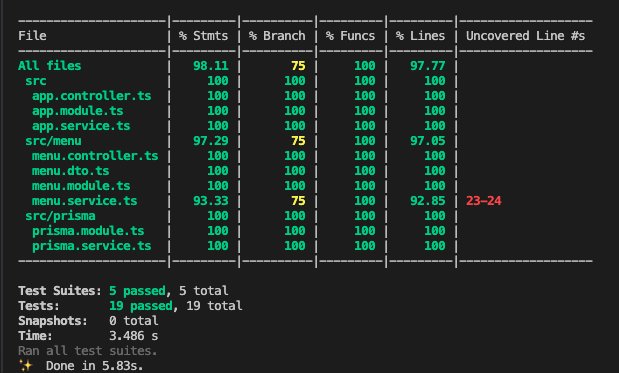
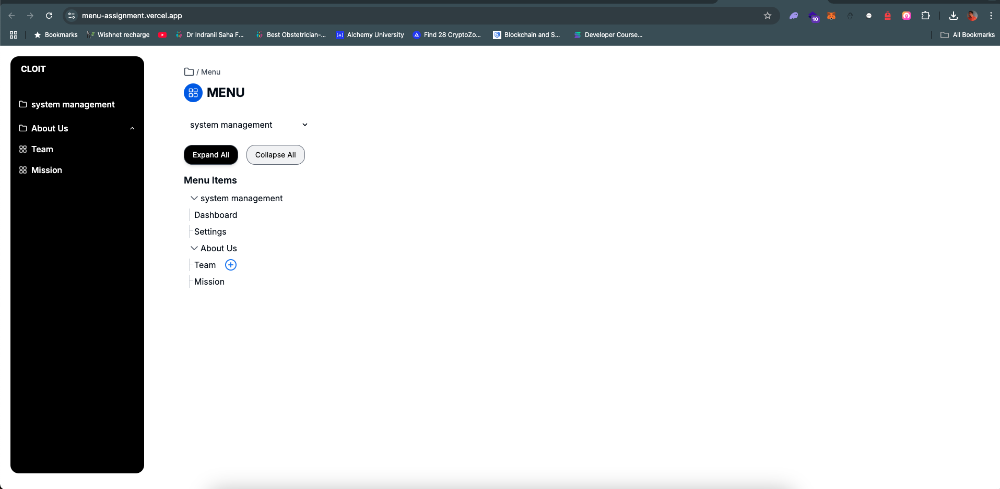

# Fullstack Menu App

This is a full-stack Typescript test project that implements a Menu management application. The application allows users to create tasks and add subtasks to them. It provides features to mark tasks and subtasks as done or undone.

## Tech Stack

### Backend

- Nest.js
- PostgreSQL
- Prisma ORM
- Swagger
- Jest

The backend application is built using the Nest.js framework. It uses the Prisma ORM to interact with the PostgreSQL database. The backend application provides a REST API for the frontend application to consume.
### Frontend

- Next.js (React)
- TailwindCSS
- Radix UI
- Zustand

The UI of the application is built using the TailwindCSS framework. The UI components are built using the Radix UI library. The application state is managed using the Zustand library.

## Project Structure

The project is divided into two main directories: `assignment-be` and `assignment-fe`. The backend directory contains the backend application, and the frontend directory contains the frontend application.


## API Documentation

The API documentation for this project is available in Swagger format. You can access it by following these steps:

1. Start the backend server by running the appropriate command.
2. Open your web browser and navigate to the following URL: 
```http://localhost:your-port/api```

Replace `your-port` with the actual port number used by the backend server.

3. The Swagger UI page will be displayed, showing the API endpoints, request/response details, and allowing you to interact with the API documentation.

Please refer to the Swagger documentation for detailed information on the API endpoints and their usage.


## Testing

To ensure the quality and reliability of the code, automated testing has been implemented. The tests cover various aspects of the application, including unit tests, integration tests, and end-to-end tests. The Jest testing framework is used for running the tests.

### Running Tests

To run the tests and check the test coverage, follow these steps:

1. Navigate to the backend directory.
2. Run the following command to execute the tests:
   ```bash
   yarn test
   ```
3. To check test coverage
```bash
   yarn test:cov
   ```



## Running the Application

### Using Docker Compose

The easiest way to run the application is to use Docker Compose. Follow these steps to run the application using Docker Compose:

1. Navigate to the root directory of the project.
2. Run the following command to start the application:
   ```bash
   docker-compose up
   ```
3. The Frontend application will be started and will be accessible at the following URL:
   ```http://localhost:3000```
4. The Backend application will be started and will be accessible at the following URL:
   ```http://localhost:4000```


## JSON API Specification

The APIs implemented in this project adhere to the JSON API specification ([jsonapi.org](http://jsonapi.org/)). The JSON API specification provides guidelines for building consistent and interoperable APIs. 

By following the JSON API specification, the project ensures that the APIs:

- Use a standardized format for request and response payloads
- Structure responses in a resource-oriented manner
- Include relationships between resources
- Handle errors consistently
- Support pagination and sorting

The adherence to the JSON API specification enables easier integration with other systems and clients that also support JSON API. It promotes consistency and simplifies the consumption of APIs.

For detailed information about the JSON API specification, please refer to the official documentation at [jsonapi.org](http://jsonapi.org/).


## UI Snapshot

 